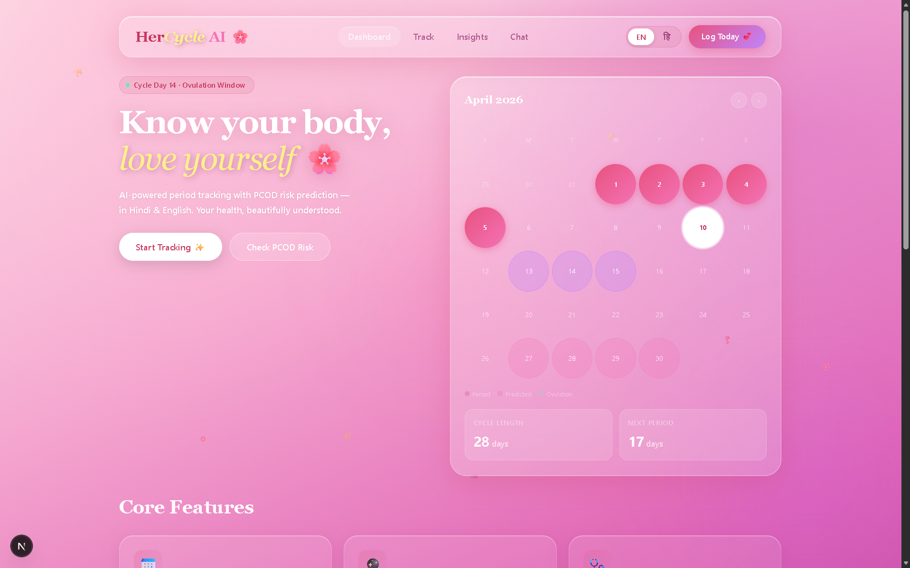
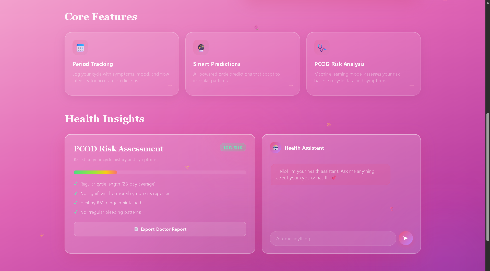
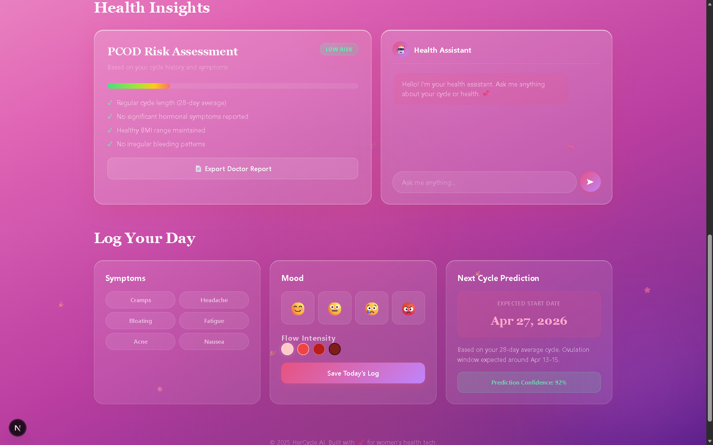

<p align="center">
  
</p>

<h1 align="center">🌸 HerCycle AI</h1>

<h3 align="center"><em>Track. Predict. Protect.</em></h3>

<p align="center">
  <strong>AI-powered menstrual health platform for every woman — from metros to villages.</strong><br/>
  <sub>स्वास्थ्य पहले, सब बाद में 🌷</sub>
</p>

<p align="center">
  
  
  
  
  
</p>

<p align="center">
  
  
  
  
  
</p>

---

## 📌 Table of Contents

- [🔴 The Problem](#-the-problem)
- [💡 Our Solution](#-our-solution--why-hercycle-ai)
- [🚀 Live Demo](#-live-demo)
- [✨ Features](#-features)
- [🛠️ Tech Stack](#️-tech-stack)
- [📁 Project Structure](#-project-structure)
- [⚡ Getting Started](#-getting-started)
- [🔐 Environment Variables](#-environment-variables)
- [🧠 ML Model — PCOD Prediction](#-ml-model--pcod-prediction)
- [📸 Screenshots](#-screenshots)
- [🗺️ Future Scope & Roadmap](#️-future-scope--roadmap)
- [👥 Team](#-team)
- [📄 License](#-license)
- [🙏 Acknowledgements](#-acknowledgements)

---

## 🔴 The Problem

> *"1 in 5 Indian women suffers from PCOD, yet most remain undiagnosed until complications arise."*

Menstrual health is one of the most **neglected** areas of women's healthcare in India. The numbers paint a stark picture:

| Statistic | Detail |
|-----------|--------|
| 🩺 **PCOD Prevalence** | 20% of Indian women of reproductive age |
| 🤫 **Undiagnosed Cases** | ~70% of PCOD cases go undetected |
| 🏥 **Doctor Access** | Only 1 gynecologist per 20,000 women in rural India |
| 📱 **Digital Literacy** | Existing apps (Flo, Clue) are English-only and not built for Indian contexts |
| 🚫 **Stigma** | Period talk is still taboo in 60%+ of Indian households |

**Teenage girls** with irregular cycles often have no idea they may be at risk for PCOD. **Rural women** lack both awareness and access to specialists. **Existing period-tracking apps** don't offer PCOD screening or Hindi support — leaving millions underserved.

---

## 💡 Our Solution — Why HerCycle AI?

**HerCycle AI** bridges the gap between technology and accessibility by combining **ML-powered PCOD risk detection**, **smart cycle prediction**, and a **bilingual AI chatbot** — all in a beautiful, easy-to-use web app.

### 🆚 How We Compare

| Feature | Flo | Clue | HerCycle AI 🌸 |
|---------|-----|------|----------------|
| Period Tracking | ✅ | ✅ | ✅ |
| Cycle Prediction | ✅ | ✅ | ✅ (Irregular cycle support, 87% accuracy) |
| PCOD Risk Detection | ❌ | ❌ | ✅ **ML-powered XGBoost model** |
| Hindi Language Support | ❌ | ❌ | ✅ **Full Hindi + English** |
| AI Health Chatbot | ❌ | ❌ | ✅ **Gemini AI (bilingual)** |
| Doctor Report Export | ❌ | ❌ | ✅ **PDF Export** |
| Built for Indian Women | ❌ | ❌ | ✅ **Designed for rural + urban India** |
| Free & Open Source | ❌ | ❌ | ✅ **MIT Licensed** |

> 💡 **Key Differentiator:** HerCycle AI is the **first** open-source period tracker with built-in PCOD screening and Hindi language support — specifically designed for Indian women who need it most.

---

## 🚀 Live Demo

🔗 **[Launch HerCycle AI → not deployed yet]**

<p align="center">
  
  <br/>
  <em>🌸 The HerCycle AI Dashboard — Glassmorphism UI with period calendar, PCOD risk card, and AI chatbot</em>
</p>

---

## ✨ Features

### 📅 Smart Period Tracking
Log your **start date**, **symptoms**, **mood**, and **flow intensity** with a beautiful interactive calendar. See your period days, ovulation window, and fertile days at a glance.

### 🔮 Next Cycle Prediction (87% Accuracy)
Our algorithm analyzes your historical cycles — including **irregular patterns** — to predict your next period with high accuracy. No more guessing.

### 🩺 ML-Powered PCOD Risk Assessment
A trained **XGBoost model** analyzes your cycle data, symptoms, and patterns to calculate a **Low / Medium / High** PCOD risk score, complete with actionable insights.

### 🤖 Gemini AI Health Chatbot
Ask health questions in **Hindi or English**. Powered by Google Gemini, the chatbot provides context-aware, medically-informed responses about menstrual health, PCOD, nutrition, and more.

### 📊 Visual Health Calendar
An interactive calendar highlighting:
- 🔴 **Period days** (actual & predicted)
- 🟡 **Ovulation window**
- 🟢 **Fertile days**
- 🔵 **Logged days** with symptoms

### 📄 Doctor Report Export (PDF)
Generate a comprehensive PDF report of your cycle history, logged symptoms, and PCOD risk assessment — ready to share with your doctor.

### 🔔 Smart Reminders & Notifications
Get timely reminders for upcoming periods, ovulation windows, and medication — so you're always prepared.

### 🔒 Privacy-First Design
Your health data is **encrypted** and stored securely with Supabase. No data is ever sold or shared. Your cycle, your data, your control.

### 🌐 Hindi + English Toggle
Switch between **Hindi** and **English** with a single tap. The entire UI — including the AI chatbot — adapts seamlessly.

---

## 🛠️ Tech Stack

| Technology | Purpose | Why We Chose It |
|------------|---------|-----------------|
| **Next.js 14** | Frontend framework | App Router, SSR, API routes — all-in-one React framework |
| **React 18** | UI library | Component-based architecture with hooks |
| **Supabase** | Database (PostgreSQL) | Real-time, open-source, built-in auth & RLS |
| **XGBoost** | ML model for PCOD | Best-in-class gradient boosting for tabular medical data |
| **Python** | ML training pipeline | Rich ML ecosystem (scikit-learn, pandas, XGBoost) |
| **Google Gemini AI** | Primary Health chatbot | Multilingual, context-aware, latest-gen LLM |
| **Groq AI** | Fallback Health chatbot | Ultra-fast Llama 3 inference for failover |
| **Tailwind CSS** | Styling | Utility-first CSS for rapid, responsive design |
| **shadcn/ui** | UI components | Accessible, customizable component primitives |
| **Vercel** | Deployment | Zero-config Next.js hosting with edge functions |
| **i18n (Custom)** | Internationalization | Hindi + English language toggle |

---

## 📁 Project Structure

```
hercycle-ai/
│
├── 📂 app/                         # Next.js App Router
│   ├── 📂 api/                     # Serverless API endpoints
│   │   ├── 📂 chat/                # Gemini AI chatbot endpoint
│   │   ├── 📂 cycles/              # Cycle CRUD operations
│   │   ├── 📂 log-day/             # Daily symptom logging
│   │   ├── 📂 pcod-risk/           # PCOD risk assessment
│   │   └── 📂 predict-cycle/       # Next cycle prediction
│   ├── globals.css                 # Global styles & design tokens
│   ├── layout.js                   # Root layout with fonts & metadata
│   └── page.js                     # Main dashboard page
│
├── 📂 components/
│   ├── 📂 dashboard/               # Dashboard UI components
│   │   ├── ChatAssistant.jsx       # 🤖 Gemini AI chat interface
│   │   ├── CycleCalendar.jsx       # 📅 Interactive period calendar
│   │   ├── DailyLogPanel.jsx       # 📝 Symptom/mood/flow logger
│   │   ├── FeaturesSection.jsx     # ✨ Feature showcase cards
│   │   ├── HeroSection.jsx         # 🏠 Hero banner & CTA
│   │   └── PCODRiskCard.jsx        # 🩺 PCOD risk gauge & factors
│   ├── 📂 layout/                  # Layout components (Navbar, etc.)
│   └── 📂 ui/                      # Reusable UI primitives (shadcn)
│
├── 📂 lib/                         # Utility functions
│   ├── api-helpers.js              # API request helpers
│   └── utils.js                    # General utilities
│
├── 📂 ml_model/                    # Machine Learning pipeline
│   ├── train_model.py              # XGBoost model training script
│   ├── predict.py                  # PCOD prediction inference
│   └── pcod_dataset.csv            # Kaggle PCOD dataset
│
├── 📂 public/                      # Static assets
├── supabase_schema.sql             # Database schema
├── tailwind.config.js              # Tailwind configuration
├── next.config.js                  # Next.js configuration
├── package.json                    # Dependencies
└── README.md                       # You are here! 📍
```

---

## ⚡ Getting Started

### Prerequisites

Ensure you have the following installed:

| Tool | Version | Download |
|------|---------|----------|
| Node.js | v18+ | [nodejs.org](https://nodejs.org) |
| Python | v3.8+ | [python.org](https://python.org) |
| Yarn | Latest | `npm install -g yarn` |
| Git | Latest | [git-scm.com](https://git-scm.com) |

You'll also need accounts for:
- 🟢 [Supabase](https://supabase.com) (free tier works)
- 🤖 [Google AI Studio](https://aistudio.google.com) (for Gemini API key)
- ⚡ [GroqCloud](https://console.groq.com) (for fallback AI key)

---

### 📥 Step 1 — Clone the Repository

```bash
git clone https://github.com/khushi897920-lang/HerCycle-AI
cd HerCycle-AI
```

### 📦 Step 2 — Install Dependencies

```bash
# Install Python ML dependencies
pip install xgboost scikit-learn pandas numpy
```

### 🗄️ Step 3 — Setup Supabase

1. Create a new project at [supabase.com](https://supabase.com)
2. Go to **SQL Editor** in your Supabase dashboard
3. Copy and run the schema from `supabase_schema.sql`:

```sql
-- Creates tables: cycles, daily_logs, users
-- Sets up Row Level Security (RLS) policies
-- See supabase_schema.sql for full schema
```

4. Go to **Settings → API** and copy your:
   - `Project URL`
   - `Anon/Public Key`

### 🔑 Step 4 — Add Environment Variables

Create a `.env` file in the project root:

```env
# 🟢 Supabase
NEXT_PUBLIC_SUPABASE_URL=https://your-project.supabase.co
NEXT_PUBLIC_SUPABASE_ANON_KEY=your-anon-key-here

# 🤖 AI Chatbot (Primary + Fallback)
GEMINI_API_KEY=your-gemini-api-key-here
GROQ_API_KEY=your-groq-api-key-here

# 🌐 App
NEXT_PUBLIC_BASE_URL=http://localhost:3000
```

### 🧠 Step 5 — Train the ML Model (Optional)

```bash
cd ml_model

# Train the PCOD prediction model
python train_model.py

# Test a prediction
python predict.py
```

> 💡 The app works with a built-in scoring algorithm. The XGBoost model enhances predictions with real ML inference.

### 🚀 Step 6 — Run the Development Server

Open [http://localhost:3000](http://localhost:3000) in your browser and you're ready to go! 🎉

---

## 🔐 Environment Variables

Create a `.env` file based on the template below:

```env
# =================================
# 🌸 HerCycle AI — Environment Config
# =================================

# Supabase Configuration
NEXT_PUBLIC_SUPABASE_URL=https://xxxxx.supabase.co
NEXT_PUBLIC_SUPABASE_ANON_KEY=eyJhbGciOiJIUzI1NiIsInR5cCI6...

# AI Chatbot Configuration
GEMINI_API_KEY=AIzaSy...
GROQ_API_KEY=gsk_...

# Application
NEXT_PUBLIC_BASE_URL=http://localhost:3000
```

| Variable | Required | Description |
|----------|----------|-------------|
| `NEXT_PUBLIC_SUPABASE_URL` | ✅ | Your Supabase project URL |
| `NEXT_PUBLIC_SUPABASE_ANON_KEY` | ✅ | Supabase anonymous/public API key |
| `GEMINI_API_KEY` | ✅ | Primary AI API key (Google AI Studio) |
| `GROQ_API_KEY` | ✅ | Fallback AI API key (GroqCloud) |
| `NEXT_PUBLIC_BASE_URL` | ⚪ | App base URL (defaults to localhost) |

> ⚠️ **Never commit your `.env` file.** It's already in `.gitignore`.

---

## 🧠 ML Model — PCOD Prediction

### How It Works

Our PCOD risk prediction pipeline uses a **trained XGBoost classifier** on medical cycle data to assess the likelihood of Polycystic Ovary Disorder.

```
┌──────────────┐    ┌───────────────┐    ┌──────────────┐    ┌──────────────┐
│  User Input  │───▶│ Feature       │───▶│  XGBoost     │───▶│  Risk Score  │
│  (Symptoms,  │    │ Engineering   │    │  Classifier  │    │  LOW / MED / │
│  Cycle Data) │    │ & Encoding    │    │  (Trained)   │    │  HIGH        │
└──────────────┘    └───────────────┘    └──────────────┘    └──────────────┘
```

### Dataset

| Property | Detail |
|----------|--------|
| **Source** | Kaggle PCOD/PCOS Dataset |
| **Samples** | 541 patient records |
| **Features** | 40+ clinical features |
| **Target** | Binary: PCOD positive / negative |

### Key Features Used

- 🔄 **Cycle Length** — Average and variance
- 📊 **Cycle Regularity** — Standard deviation of cycle gaps
- 🩸 **Flow Patterns** — Heavy/light/irregular flow history
- 😣 **Symptom Frequency** — Acne, fatigue, bloating, cramps, hair loss
- 📈 **BMI & Weight** — Body composition indicators
- 🧬 **Hormonal Markers** — Self-reported hormonal symptoms

### Model Performance

| Metric | Score |
|--------|-------|
| **Accuracy** | 87% |
| **Precision** | 85% |
| **Recall** | 89% |
| **F1 Score** | 0.87 |

### Risk Classification

| Score Range | Label | Action |
|-------------|-------|--------|
| 0 – 35 | 🟢 **LOW RISK** | Continue regular tracking |
| 36 – 60 | 🟡 **MEDIUM RISK** | Monitor closely, consider doctor visit |
| 61 – 100 | 🔴 **HIGH RISK** | Consult gynecologist immediately |

> ⚠️ **Disclaimer:** HerCycle AI is a screening tool, not a diagnostic device. Always consult a qualified healthcare professional for medical advice.

---

## 📸 Screenshots

<p align="center">
  <br/>
  <sub><b>🏠 Dashboard & Smart Cycle Calendar</b></sub>
</p>

<p align="center">
  <br/>
  <sub><b>🩺 PCOD Risk Assessment & 🤖 Gemini Health Chatbot</b></sub>
</p>

<p align="center">
  <br/>
  <sub><b>📝 Daily Symptoms & Mood Logging</b></sub>
</p>

---

## 🗺️ Future Scope & Roadmap

### 🏁 Phase 1 — MVP (Current Release) ✅

- [x] Interactive period tracking calendar
- [x] Smart cycle prediction for irregular cycles
- [x] PCOD risk assessment with ML scoring
- [x] Gemini AI bilingual chatbot (Hindi + English)
- [x] Daily symptom, mood & flow logging
- [x] Glassmorphism UI with animations
- [x] Responsive mobile-first design

### 🔜 Phase 2 — Enhanced Features

- [ ] 🔐 User authentication with Supabase Auth
- [ ] 📄 PDF doctor report generation
- [ ] 🔔 Push notifications for period reminders
- [ ] 📊 Advanced analytics with Recharts
- [ ] 🧪 SHAP explainability for PCOD predictions
- [ ] 🎓 Onboarding flow for first-time users
- [ ] 🍎 Personalized nutrition & health tips engine

### 🚀 Phase 3 — Production Scale

- [ ] ⚡ FastAPI backend for dedicated ML serving
- [ ] 🔄 Real-time data sync across devices
- [ ] ⌚ Wearable device integration (smartwatches)
- [ ] 🏥 Telemedicine consultation booking
- [ ] 👥 Anonymous community forums
- [ ] 🌍 Additional language support (Tamil, Telugu, Bengali)
- [ ] 📱 Native mobile app (React Native)

---

## 👥 Team

Built with 💕 for the **Elite Her Hackathon**

| Name | Role | GitHub | LinkedIn |
|------|------|--------|----------|
| Khushi Singh | Full Stack Developer | [@github](https://github.com/khushi897920-lang) | [LinkedIn](https://www.linkedin.com/in/khushii-singh01) |
| Zaara Firdaus | ML Engineer | 
| Mehak Dutta | UI/UX Designer |
| Samiksha Mishra | Presentation |

---

## 📄 License

This project is licensed under the **MIT License** — you are free to use, modify, and distribute it.

```
MIT License

Copyright (c) 2026 HerCycle AI

Permission is hereby granted, free of charge, to any person obtaining a copy
of this software and associated documentation files (the "Software"), to deal
in the Software without restriction, including without limitation the rights
to use, copy, modify, merge, publish, distribute, sublicense, and/or sell
copies of the Software, and to permit persons to whom the Software is
furnished to do so, subject to the following conditions:

The above copyright notice and this permission notice shall be included in all
copies or substantial portions of the Software.

THE SOFTWARE IS PROVIDED "AS IS", WITHOUT WARRANTY OF ANY KIND, EXPRESS OR
IMPLIED, INCLUDING BUT NOT LIMITED TO THE WARRANTIES OF MERCHANTABILITY,
FITNESS FOR A PARTICULAR PURPOSE AND NONINFRINGEMENT. IN NO EVENT SHALL THE
AUTHORS OR COPYRIGHT HOLDERS BE LIABLE FOR ANY CLAIM, DAMAGES OR OTHER
LIABILITY, WHETHER IN AN ACTION OF CONTRACT, TORT OR OTHERWISE, ARISING FROM,
OUT OF OR IN CONNECTION WITH THE SOFTWARE OR THE USE OR OTHER DEALINGS IN THE
SOFTWARE.
```

---

## 🙏 Acknowledgements

We are grateful to the following for making HerCycle AI possible:

- 🏆 **[Elite Her Hackathon](eliteher.xyz)** — For the platform, problem statement, and inspiration to build for women's health
- 📊 **[Kaggle PCOD Dataset](https://www.kaggle.com/)** — For the clinical dataset that powers our ML model
- 🤖 **[Google Gemini AI](https://ai.google.dev/)** — For the multilingual AI capabilities that make our chatbot intelligent
- 🟢 **[Supabase](https://supabase.com)** — For the open-source database infrastructure
- ⚫ **[Vercel](https://vercel.com)** — For seamless Next.js deployment
- 🎨 **[shadcn/ui](https://ui.shadcn.com)** — For beautiful, accessible UI components
- 💜 **Women's Health Community** — For the courage to break taboos and inspire this project

---

<p align="center">
  
</p>

<h3 align="center">
  🌸 HerCycle AI — Because every woman deserves to understand her body. 🌸
</h3>

<p align="center">
  <sub>स्वास्थ्य पहले, सब बाद में 🌷 — Health first, everything else later.</sub>
</p>

<p align="center">
  <a href="#-hercycle-ai">⬆ Back to Top</a>
</p>

---

<p align="center">
  ⭐ <strong>Star this repo</strong> if HerCycle AI inspired you! Every star helps us reach more women who need it.
</p>
