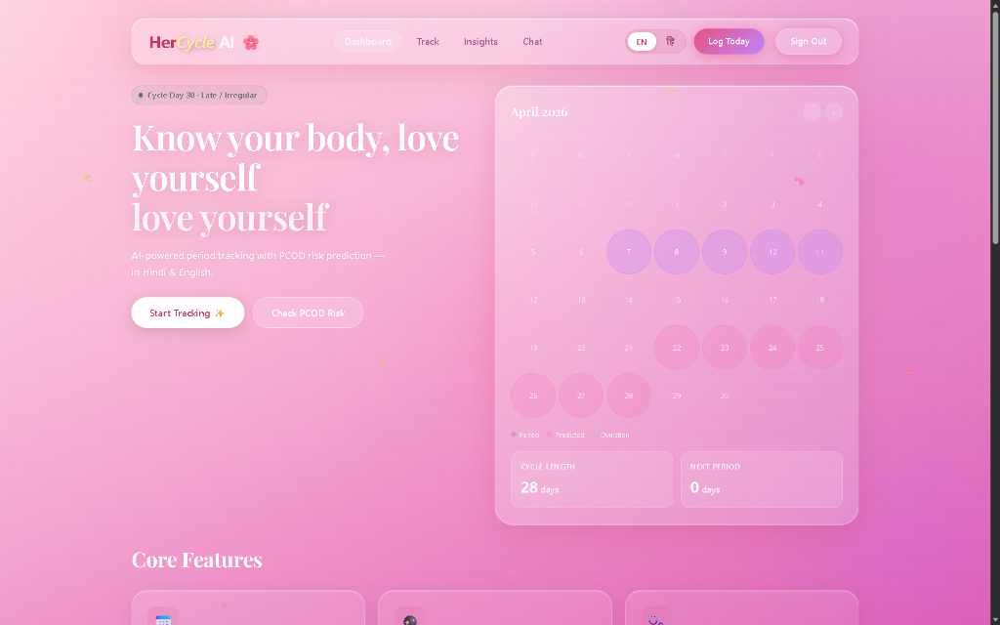
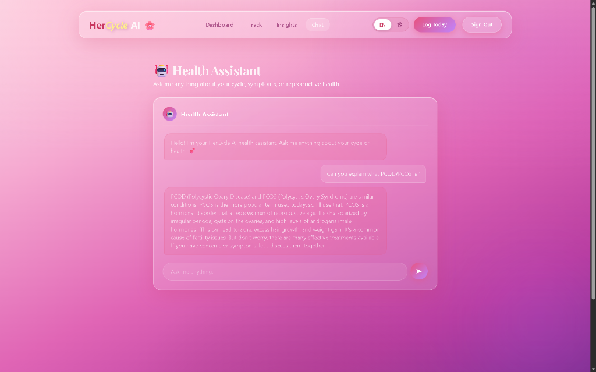
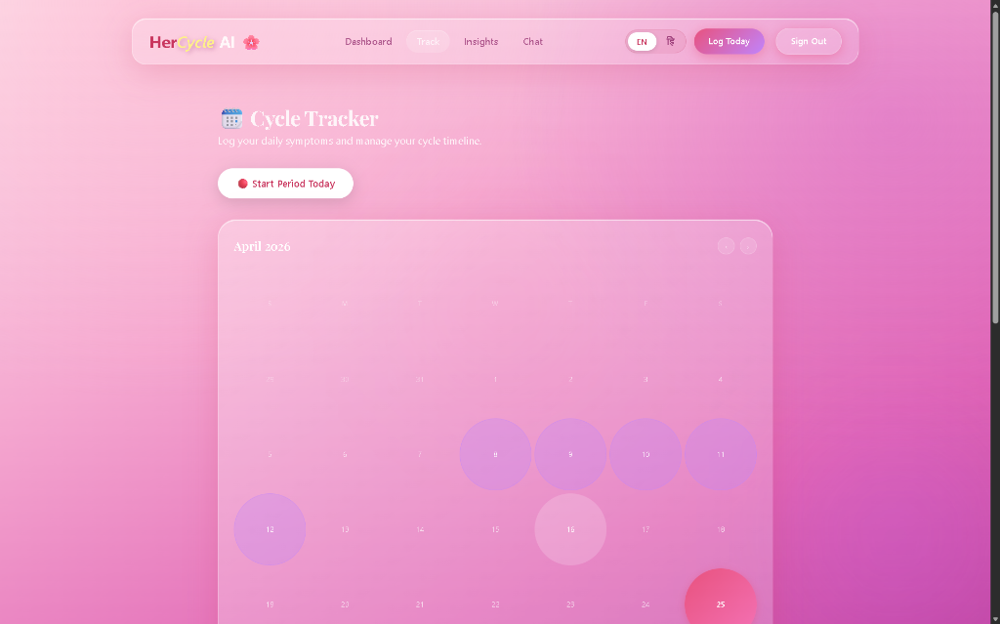
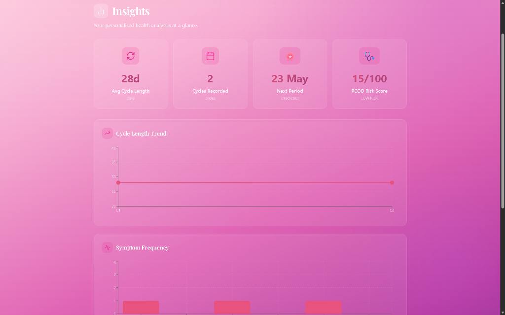

<div align="center">

# 🌸 HerCycle AI

### *Know your body. Love yourself.*

**AI-powered menstrual health companion built for modern Indian women**

[](https://hercycle-ai.vercel.app)
[](https://nextjs.org/)
[](https://supabase.com/)
[](https://ai.google.dev/)
[](https://vercel.com/)
[](LICENSE)

</div>

---

## 📸 Screenshots

### 🏠 Dashboard — *"Know your body, love yourself"*


<table>
<tr>
<td width="50%">

### 🗓️ Cycle Tracker


</td>
<td width="50%">

### 📊 Insights & Analytics


</td>
</tr>
<tr>
<td colspan="2">

### 🤖 AI Health Assistant


</td>
</tr>
</table>

---

## ✨ Features

| Feature | Description |
|---------|-------------|
| 🗓️ **Smart Cycle Calendar** | Visual month-view calendar with color-coded period days, ovulation windows, and predicted future cycles |
| 🤖 **AI Health Assistant** | Powered by **Google Gemini 2.0 Flash** with automatic **Groq LLaMA 3.1** fallback — always online |
| 📝 **Daily Symptom Logging** | Log symptoms, mood, and flow intensity with smart upsert — edit any day, any time |
| 🔮 **Cycle Prediction** | Statistical prediction engine with confidence score based on personal cycle history |
| 🩺 **PCOD Risk Assessment** | Automated risk scoring (LOW / MEDIUM / HIGH) based on cycle regularity and symptom patterns |
| 📄 **Doctor Report PDF Export** | Generate a professional PDF health report to share with your doctor |
| 🌐 **Bilingual Support** | Full Hindi (हिंदी) and English language toggle throughout the app |
| 🔐 **Secure Auth** | Email/password + Google OAuth via Supabase Auth with middleware route protection |
| 🌙 **Beautiful UI** | Glassmorphism design with pink-purple gradient, smooth animations, and mobile-responsive layout |

---

## 🛠️ Tech Stack

| Layer | Technology |
|-------|-----------|
| **Frontend** | Next.js 16 (App Router), React 18 |
| **Styling** | Vanilla CSS, Glassmorphism, Radix UI |
| **Charts** | Recharts (Line, Bar, custom tooltips) |
| **Backend** | Next.js API Routes (serverless) |
| **Database** | Supabase (PostgreSQL) |
| **Auth** | Supabase Auth + `@supabase/ssr` |
| **AI (Primary)** | Google Gemini 2.0 Flash |
| **AI (Fallback)** | Groq LLaMA 3.1 8B Instant |
| **PDF Export** | jsPDF + jsPDF-AutoTable |
| **Deployment** | Vercel (Edge Network) |
| **Language** | JavaScript (ES2022) |

---

## 🚀 Getting Started

### Prerequisites

- Node.js `>= 18.x`
- A [Supabase](https://supabase.com/) account (free tier works)
- A [Google AI Studio](https://aistudio.google.com/) API key (Gemini)
- A [Groq](https://console.groq.com/) API key (free, optional fallback)

### Installation

```bash
# 1. Clone the repository
git clone https://github.com/khushi897920-lang/hercycle-ai.git
cd hercycle-ai

# 2. Install dependencies
npm install

# 3. Set up environment variables
cp .env.example .env.local
```

### Environment Variables

Open `.env.local` and fill in your keys:

```env
# Supabase (required)
NEXT_PUBLIC_SUPABASE_URL=https://your-project.supabase.co
NEXT_PUBLIC_SUPABASE_ANON_KEY=your_anon_key_here
SUPABASE_SERVICE_ROLE_KEY=your_service_role_key_here

# AI APIs (at least one required)
GEMINI_API_KEY=your_gemini_api_key_here
GROQ_API_KEY=your_groq_api_key_here
```

### Run Locally

```bash
npm run dev
# Open http://localhost:3000
```

---

## 🗄️ Database Setup

This project uses [Supabase](https://supabase.com/) as its database. Create a free project and run the following SQL in the **SQL Editor**:

### Create Tables

```sql
-- Cycles table
CREATE TABLE cycles (
  id            UUID DEFAULT gen_random_uuid() PRIMARY KEY,
  user_id       UUID NOT NULL REFERENCES auth.users(id) ON DELETE CASCADE,
  start_date    DATE NOT NULL,
  end_date      DATE,
  cycle_length  INTEGER DEFAULT 28,
  flow_intensity TEXT,
  created_at    TIMESTAMPTZ DEFAULT now()
);

-- Daily logs table
CREATE TABLE daily_logs (
  id         UUID DEFAULT gen_random_uuid() PRIMARY KEY,
  user_id    UUID NOT NULL REFERENCES auth.users(id) ON DELETE CASCADE,
  date       DATE NOT NULL,
  symptoms   TEXT[],
  mood       TEXT,
  flow       TEXT,
  updated_at TIMESTAMPTZ DEFAULT now(),
  created_at TIMESTAMPTZ DEFAULT now(),
  CONSTRAINT daily_logs_user_date_unique UNIQUE (user_id, date)
);
```

### Row Level Security (RLS)

```sql
-- Enable RLS and allow users to manage their own data
ALTER TABLE cycles ENABLE ROW LEVEL SECURITY;
ALTER TABLE daily_logs ENABLE ROW LEVEL SECURITY;

CREATE POLICY "Users can manage their own cycles"
  ON cycles FOR ALL USING (auth.uid() = user_id);

CREATE POLICY "Users can manage their own daily logs"
  ON daily_logs FOR ALL USING (auth.uid() = user_id);
```

---

## ☁️ Deployment

### Deploy to Vercel (Recommended)

[](https://vercel.com/new/clone?repository-url=https://github.com/khushi897920-lang/hercycle-ai)

1. Click the button above or import your forked repo at [vercel.com](https://vercel.com)
2. Add **all environment variables** from `.env.example` in the Vercel dashboard
3. Deploy — Vercel auto-detects Next.js and configures everything

### Configure Supabase Auth URLs

In your **Supabase Dashboard → Authentication → URL Configuration**:

| Setting | Value |
|---------|-------|
| **Site URL** | `https://hercycle-ai.vercel.app` |
| **Redirect URLs** | `https://hercycle-ai.vercel.app/auth/callback` |

### Enable Google OAuth

1. Go to **Supabase Dashboard → Authentication → Providers → Google**
2. Enable Google provider
3. Add your **Google Client ID** and **Client Secret** from [Google Cloud Console](https://console.cloud.google.com/)
4. Add `https://your-project.supabase.co/auth/v1/callback` as an authorized redirect URI in Google Cloud

---

## 🗺️ Roadmap

```
Phase 1  ✅  Core dashboard with AI chat and cycle calendar
Phase 2  ✅  User authentication (email + Google OAuth)
Phase 3  ✅  Multi-page routing (Track, Insights, Chat)
Phase 4  🔲  Full Hindi localization across all pages
Phase 5  🔲  Mobile app (React Native / Expo)
Phase 6  🔲  Doctor Connect — share reports directly with verified doctors
Phase 7  🔲  Wearable integration (smart ring / watch sync)
Phase 8  🔲  Community forum for anonymous peer support
```

---

## 🤝 Contributing

Contributions, issues, and feature requests are welcome!

```bash
# Fork the repo, then:
git checkout -b feature/your-feature-name
git commit -m "feat: add your feature"
git push origin feature/your-feature-name
# Open a Pull Request
```

Please make sure your code:
- Has no `console.log` debug statements
- Uses `start_date` / `end_date` for cycle columns (not `period_start` / `period_end`)
- Follows the existing `@supabase/ssr` client pattern

---

## 📄 License

This project is licensed under the **MIT License** — see the [LICENSE](LICENSE) file for details.

---

<div align="center">

Built with 💕 for women's health tech

**HerCycle AI — Know your body, love yourself** 🌸

*Made in India 🇮🇳 · Powered by AI · Built for every woman*

</div>