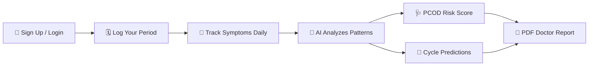

<div align="center">

# 🌸 HerCycle AI

### *Know your body. Love yourself.*

**AI-powered menstrual health companion built for modern Indian women**

[](https://hercycle-ai.vercel.app)
[](https://nextjs.org/)
[](https://supabase.com/)
[](https://ai.google.dev/)
[](https://vercel.com/)
[](LICENSE)

</div>

<div align="center">


</div>

---

> 💬 *"1 in 5 Indian women has PCOD. Most are undiagnosed.*
> *We built HerCycle AI to change that."*

---

<div align="center">

<table>
<tr>
<td align="center"><b>🌍 355M+</b><br/><sub>Women in India</sub></td>
<td align="center"><b>🤖 Gemini 2.0</b><br/><sub>AI Powered</sub></td>
<td align="center"><b>🌐 EN + हिंदी</b><br/><sub>Bilingual</sub></td>
<td align="center"><b>🩺 PCOD AI</b><br/><sub>Risk Screening</sub></td>
<td align="center"><b>⚡ Live</b><br/><sub>Deployed on Vercel</sub></td>
</tr>
</table>

</div>

---

## 📸 Screenshots

### 🏠 Dashboard — *"Know your body, love yourself"*


<table>
<tr>
<td width="50%">

### 🗓️ Cycle Tracker


</td>
<td width="50%">

### 📊 Insights & Analytics


</td>
</tr>
<tr>
<td colspan="2">

### 🤖 AI Health Assistant


</td>
</tr>
</table>

---

## ✨ Features

| Feature | Description |
|---------|-------------|
| 🗓️ **Smart Cycle Calendar** | Visual month-view calendar with color-coded period days, ovulation windows, and predicted future cycles |
| 🤖 **AI Health Assistant** | Powered by **Google Gemini 2.0 Flash** with automatic **Groq LLaMA 3.1** fallback — always online |
| 📝 **Daily Symptom Logging** | Log symptoms, mood, and flow intensity with smart upsert — edit any day, any time |
| 🔮 **Cycle Prediction** | Statistical prediction engine with confidence score based on personal cycle history |
| 🩺 **PCOD Risk Assessment** | Automated risk scoring (LOW / MEDIUM / HIGH) based on cycle regularity and symptom patterns |
| 📄 **Doctor Report PDF Export** | Generate a professional PDF health report to share with your doctor |
| 🌐 **Bilingual Support** | Full Hindi (हिंदी) and English language toggle throughout the app |
| 🔐 **Secure Auth** | Email/password + Google OAuth via Supabase Auth with middleware route protection |
| 🌙 **Beautiful UI** | Glassmorphism design with pink-purple gradient, smooth animations, and mobile-responsive layout |

---

## 🔄 How It Works



> **Step 1** — Sign up with email or Google · **Step 2** — Log your period start/end dates  
> **Step 3** — Track daily symptoms & mood · **Step 4** — AI analyzes your patterns  
> **Step 5** — Get PCOD risk score & cycle predictions · **Step 6** — Export a PDF report for your doctor

---

## 🛠️ Tech Stack

| Layer | Technology |
|-------|-----------|
| **Frontend** | Next.js 16 (App Router), React 18 |
| **Styling** | Vanilla CSS, Glassmorphism, Radix UI |
| **Charts** | Recharts (Line, Bar, custom tooltips) |
| **Backend** | Next.js API Routes (serverless) |
| **Database** | Supabase (PostgreSQL) |
| **Auth** | Clerk (@clerk/nextjs) |
| **AI (Primary)** | Google Gemini 2.0 Flash |
| **AI (Fallback)** | Groq LLaMA 3.1 8B Instant |
| **PDF Export** | jsPDF + jsPDF-AutoTable |
| **Deployment** | Vercel (Edge Network) |
| **Language** | JavaScript (ES2022) |

---

## 🚀 Getting Started

### Prerequisites

- Node.js `>= 18.x`
- A [Supabase](https://supabase.com/) account (free database hosting)
- A [Clerk](https://clerk.com/) account (free user authentication)
- A [Google AI Studio](https://aistudio.google.com/) API key (Gemini)
- A [Groq](https://console.groq.com/) API key (free, optional fallback)

### Installation

```bash
# 1. Clone the repository
git clone https://github.com/khushi897920-lang/hercycle-ai.git
cd hercycle-ai

# 2. Install dependencies
npm install

# 3. Set up environment variables
cp .env.example .env.local
```

### Environment Variables

Open `.env.local` and fill in your keys:

```env
# Supabase Database (required)
NEXT_PUBLIC_SUPABASE_URL=https://your-project.supabase.co
NEXT_PUBLIC_SUPABASE_ANON_KEY=your_anon_key_here
SUPABASE_SERVICE_ROLE_KEY=your_service_role_key_here

# Clerk Auth (required)
NEXT_PUBLIC_CLERK_PUBLISHABLE_KEY=pk_test_your_clerk_key_here
CLERK_SECRET_KEY=sk_test_your_clerk_secret_here
CLERK_WEBHOOK_SECRET=whsec_your_clerk_webhook_secret_here

# AI APIs (at least one required)
GEMINI_API_KEY=your_gemini_api_key_here
GROQ_API_KEY=your_groq_api_key_here
```

### Run Locally

```bash
npm run dev
# Open http://localhost:3000
```

---

## 🗄️ Database Setup

This project uses [Supabase](https://supabase.com/) as its database. Create a free project and run the following SQL in the **SQL Editor**:


 **Note**
Execute the following SQL sections in order:

1. Extensions
2. Create Tables
3. Foreign Keys
4. Row Level Security
5. Indexes
6. Realtime
7. Seed Data
8. RLS Policies


### Create Tables

| Table | Purpose |
|--------|---------|
| users | Mirrors authenticated Clerk users |
| cycles | Stores menstrual cycle data |
| daily_logs | Stores symptoms, mood, flow and cervical discharge |
| weight_entries | Weight & BMI tracking |
| partner_connections | Partner pairing |
| partner_permissions | Sharing permissions |
| forum_categories | Community categories |
| forum_posts | Community posts |
| forum_comments | Community comments |
| forum_votes | Vote tracking |

```sql

-- Extensions
CREATE EXTENSION IF NOT EXISTS "uuid-ossp";
CREATE EXTENSION IF NOT EXISTS "pgcrypto";

-- Users table
CREATE TABLE IF NOT EXISTS public.users (
  id TEXT PRIMARY KEY,
  created_at TIMESTAMPTZ DEFAULT now()
);

-- Cycles table
CREATE TABLE IF NOT EXISTS public.cycles (
  id UUID DEFAULT gen_random_uuid() PRIMARY KEY,
  user_id TEXT NOT NULL,
  start_date DATE NOT NULL,
  end_date DATE,
  cycle_length INTEGER DEFAULT 28,
  created_at TIMESTAMPTZ DEFAULT now()
);

-- Daily logs table
CREATE TABLE IF NOT EXISTS public.daily_logs (
  id UUID DEFAULT gen_random_uuid() PRIMARY KEY,
  user_id TEXT NOT NULL,
  date DATE NOT NULL,
  symptoms TEXT[],
  mood TEXT,
  flow TEXT,
  cervical_discharge TEXT,
  updated_at TIMESTAMPTZ DEFAULT now(),
  CONSTRAINT daily_logs_user_date_unique UNIQUE (user_id, date)
);

-- Weight Tracker
CREATE TABLE IF NOT EXISTS public.weight_entries (
  id UUID DEFAULT gen_random_uuid() PRIMARY KEY,
  user_id TEXT NOT NULL,
  recorded_date DATE NOT NULL,
  weight_kg NUMERIC(5,2) NOT NULL CHECK (weight_kg >= 20 AND weight_kg <= 350),
  waist_cm NUMERIC(5,2) CHECK (waist_cm IS NULL OR (waist_cm >= 30 AND waist_cm <= 250)),
  height_cm NUMERIC(5,2) NOT NULL CHECK (height_cm >= 100 AND height_cm <= 250),
  bmi NUMERIC(5,2) NOT NULL CHECK (bmi >= 5 AND bmi <= 100),
  created_at TIMESTAMPTZ DEFAULT now(),
  updated_at TIMESTAMPTZ DEFAULT now(),
  CONSTRAINT weight_entries_user_date_unique UNIQUE (user_id, recorded_date)
);

-- Partner Connections
CREATE TABLE IF NOT EXISTS public.partner_connections (
    id UUID DEFAULT gen_random_uuid() PRIMARY KEY,
    primary_user_id TEXT NOT NULL,
    partner_user_id TEXT,
    pairing_code TEXT UNIQUE NOT NULL,
    status TEXT NOT NULL DEFAULT 'pending'
      CHECK (status IN ('pending','active')),
    created_at TIMESTAMPTZ DEFAULT now()
);

CREATE TABLE IF NOT EXISTS public.partner_permissions (
    connection_id UUID PRIMARY KEY
      REFERENCES public.partner_connections(id)
      ON DELETE CASCADE,
    show_mood BOOLEAN DEFAULT false,
    show_symptoms BOOLEAN DEFAULT false,
    show_fertile_window BOOLEAN DEFAULT true,
    show_notes BOOLEAN DEFAULT false,
    updated_at TIMESTAMPTZ DEFAULT now()
);

-- Forum Categories
CREATE TABLE IF NOT EXISTS public.forum_categories (
    id UUID PRIMARY KEY DEFAULT gen_random_uuid(),
    name TEXT NOT NULL,
    slug TEXT NOT NULL UNIQUE,
    description TEXT,
    created_at TIMESTAMPTZ DEFAULT now()
);

-- Forum Posts
CREATE TABLE IF NOT EXISTS public.forum_posts (
    id UUID PRIMARY KEY DEFAULT gen_random_uuid(),
    category_id UUID REFERENCES public.forum_categories(id) ON DELETE CASCADE,
    author_alias TEXT NOT NULL,
    title TEXT NOT NULL,
    content TEXT NOT NULL,
    upvotes INTEGER DEFAULT 0,
    created_at TIMESTAMPTZ DEFAULT now()
);

-- Forum Comments
CREATE TABLE IF NOT EXISTS public.forum_comments (
    id UUID PRIMARY KEY DEFAULT gen_random_uuid(),
    post_id UUID REFERENCES public.forum_posts(id) ON DELETE CASCADE,
    author_alias TEXT NOT NULL,
    content TEXT NOT NULL,
    upvotes INTEGER DEFAULT 0,
    created_at TIMESTAMPTZ DEFAULT now()
);

-- Forum Votes
CREATE TABLE IF NOT EXISTS public.forum_votes (
    id UUID PRIMARY KEY DEFAULT gen_random_uuid(),
    user_id TEXT NOT NULL,
    item_type TEXT NOT NULL CHECK (item_type IN ('post','comment')),
    item_id UUID NOT NULL,
    vote_value INTEGER NOT NULL CHECK (vote_value IN (1,-1)),
    created_at TIMESTAMPTZ DEFAULT now(),
    UNIQUE(user_id,item_type,item_id)
);

```

### Row Level Security (RLS)

```sql
-- Enable Row Level Security (RLS)
ALTER TABLE public.users ENABLE ROW LEVEL SECURITY;
ALTER TABLE public.cycles ENABLE ROW LEVEL SECURITY;
ALTER TABLE public.daily_logs ENABLE ROW LEVEL SECURITY;
ALTER TABLE public.weight_entries ENABLE ROW LEVEL SECURITY;
ALTER TABLE public.partner_connections ENABLE ROW LEVEL SECURITY;
ALTER TABLE public.partner_permissions ENABLE ROW LEVEL SECURITY;
ALTER TABLE public.forum_categories ENABLE ROW LEVEL SECURITY;
ALTER TABLE public.forum_posts ENABLE ROW LEVEL SECURITY;
ALTER TABLE public.forum_comments ENABLE ROW LEVEL SECURITY;
ALTER TABLE public.forum_votes ENABLE ROW LEVEL SECURITY;

```
### Indexes

```sql

CREATE INDEX IF NOT EXISTS idx_cycles_user_id
ON public.cycles(user_id);

CREATE INDEX IF NOT EXISTS idx_daily_logs_user_id_date
ON public.daily_logs(user_id, date);

CREATE INDEX IF NOT EXISTS idx_weight_entries_user_date
ON public.weight_entries(user_id, recorded_date DESC);

CREATE INDEX IF NOT EXISTS idx_partner_conn_primary
ON public.partner_connections(primary_user_id);

CREATE INDEX IF NOT EXISTS idx_partner_conn_partner
ON public.partner_connections(partner_user_id);
```
### Foreign Keys

```sql
ALTER TABLE public.cycles
DROP CONSTRAINT IF EXISTS cycles_user_id_fkey;

ALTER TABLE public.cycles
ADD CONSTRAINT cycles_user_id_fkey
FOREIGN KEY (user_id)
REFERENCES public.users(id)
ON DELETE CASCADE;

ALTER TABLE public.daily_logs
DROP CONSTRAINT IF EXISTS daily_logs_user_id_fkey;

ALTER TABLE public.daily_logs
ADD CONSTRAINT daily_logs_user_id_fkey
FOREIGN KEY (user_id)
REFERENCES public.users(id)
ON DELETE CASCADE;
```
### Realtime

```sql
BEGIN;
DROP PUBLICATION IF EXISTS supabase_realtime;
CREATE PUBLICATION supabase_realtime;
COMMIT;

ALTER PUBLICATION supabase_realtime
ADD TABLE public.forum_posts;

ALTER PUBLICATION supabase_realtime
ADD TABLE public.forum_comments;
```

### Seed Data

```sql
INSERT INTO public.forum_categories (name, slug, description)
VALUES
('PCOD Advice','pcod-advice','Share tips and ask questions about managing PCOD.'),
('Cycle Tracking','cycle-tracking','Discuss period tracking, ovulation, and cycle irregularities.'),
('Mental Health','mental-health','A safe space to talk about emotional well-being and stress.'),
('General Discussion', 'general-discussion', 'Talk about anything else related to women''s health.')
ON CONFLICT (slug) DO NOTHING;

```
### RLS Policies
```sql
DROP POLICY IF EXISTS "forum_categories_public_read" ON public.forum_categories;
CREATE POLICY "forum_categories_public_read"
ON public.forum_categories
FOR SELECT
USING (true);

DROP POLICY IF EXISTS "forum_posts_public_read" ON public.forum_posts;
CREATE POLICY "forum_posts_public_read"
ON public.forum_posts
FOR SELECT
USING (true);

DROP POLICY IF EXISTS "forum_comments_public_read" ON public.forum_comments;
CREATE POLICY "forum_comments_public_read"
ON public.forum_comments
FOR SELECT
USING (true);

DROP POLICY IF EXISTS "forum_votes_public_read" ON public.forum_votes;
CREATE POLICY "forum_votes_public_read"
ON public.forum_votes
FOR SELECT
USING (true);
```

---

## ☁️ Deployment

### Deploy to Vercel (Recommended)

[](https://vercel.com/new/clone?repository-url=https://github.com/khushi897920-lang/hercycle-ai)

1. Click the button above or import your forked repo at [vercel.com](https://vercel.com)
2. Add **all environment variables** from `.env.example` in the Vercel dashboard
3. Deploy — Vercel auto-detects Next.js and configures everything

### Configure Clerk Redirects

In your **Clerk Dashboard → Paths / Redirects**:

* Set **Sign-in Path** to `/auth/login`
* Set **Sign-up Path** to `/auth/signup`
* Set **After Sign-in Redirect URL** to `/`
* Set **After Sign-up Redirect URL** to `/`

### Configure Clerk Webhook (Account Deletion Cascade)

1. Go to **Clerk Dashboard → Webhooks** and click **Add Endpoint**.
2. Set Endpoint URL to `https://your-domain.vercel.app/api/webhooks/clerk`.
3. Subscribe to the `user.deleted` event.
4. Copy the Signing Secret and configure it in your Vercel/production environment as `CLERK_WEBHOOK_SECRET`. This triggers a cascading purge of user cycles and logs when their account is deleted.

---

## 🗺️ Roadmap

```
Phase 1  ✅  Core dashboard with AI chat and cycle calendar
Phase 2  ✅  User authentication (email + Google OAuth)
Phase 3  ✅  Multi-page routing (Track, Insights, Chat)
Phase 4  🔲  Full Hindi localization across all pages
Phase 5  🔲  Mobile app (React Native / Expo)
Phase 6  🔲  Doctor Connect — share reports directly with verified doctors
Phase 7  🔲  Wearable integration (smart ring / watch sync)
Phase 8  🔲  Community forum for anonymous peer support
```

---

## 📊 Project Progress

| Feature | Progress |
|---------|----------|
| Core Dashboard |  |
| AI Chat (EN+HI) |  |
| PCOD Risk Engine |  |
| User Authentication |  |
| Cycle Prediction |  |
| PDF Doctor Report |  |
| Hindi Localization |  |
| Mobile App |  |
| Doctor Connect |  |

---

## 👩‍💻 Contributors

Thank you to all the amazing people who built HerCycle AI!

### Sole Builder & Project Lead

| Avatar | Name | Role | GitHub | LinkedIn |
|--------|------|------|--------|----------|
|  | **Khushi Singh** | Sole Builder / Project Lead<br/><sub>(Full Stack Developer, AI Integration, Database, UI/UX — everything)</sub> | [@khushi897920-lang](https://github.com/khushi897920-lang) | [LinkedIn](https://www.linkedin.com/in/khushii-singh01) |

### 💖 Acknowledgements / Special Thanks

#### Early Contributors
*Note: Contributed during initial prototype phase*

- **zaaraf027-glitch** —  Database ([@zaaraf027-glitch](https://github.com/zaaraf027-glitch))
- **Samiksha48787** —  Presentation ([@Samiksha48787](https://github.com/Samiksha48787))

---

[](#-contributors)

---

## 🤝 Contributing

Contributions, issues, and feature requests are welcome! 
## 🏆 ECSOC Contributors

This project is officially participating in **ECSOC 2026**.

To ensure your contribution is evaluated by the ECSOC Sentinel system, please follow these requirements carefully.

### Before You Start
- Fork the repository.
- Comment on an issue and wait for it to be assigned.
- Work on only one assigned issue at a time.
- Create a separate branch for your changes.

### Pull Request Requirements

Every Pull Request **must**:

- Reference the issue using:
  ```text
  Fixes #<issue_number>
  ```

- Include the **ECSoc26** label.

> ⚠️ **Important**
>
> Pull Requests **without the `ECSoc26` label will NOT be processed by ECSOC Sentinel and will not be scored.**

- Pass all GitHub Actions checks.
- Build successfully (`npm run build`).
- Follow the project's coding standards.
- Update documentation when applicable.

Thank you for contributing and best of luck in ECSOC! 🚀

For comprehensive instructions on setting up, code styles, and opening pull requests, please read our **[Contribution Guide](docs/CONTRIBUTING.md)**.

Please make sure your code:
* Has no `console.log` debug statements (use `logger` from `@/lib/logger`).
* Uses `start_date` / `end_date` for cycle columns (not `period_start` / `period_end`).
* Uses the server-side `getSupabaseAdmin()` client helper for database updates.
* Passes the integration checks: `node scripts/production-check.js`.

---

## 📄 License

This project is licensed under the **MIT License** — see the [LICENSE](LICENSE) file for details.

---

## 📈 Repository Activity


<div align="center">


</div>

<div align="center">

---


### 🌸 Thank you for visiting HerCycle AI

*Every woman deserves to understand her own body.*
*I built this so she can.*

[](https://hercycle-ai.vercel.app)
[](https://github.com/khushi897920-lang/hercycle-ai)
[](#-contributors)

<br/>

*Made with* 💕 *in India 🇮🇳*

*© 2026 Khushi Singh · MIT License*

</div>
