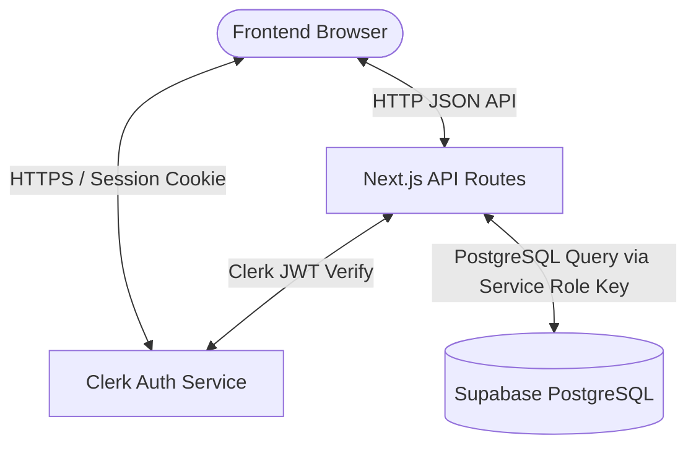

# Database Overview

This document provides a high-level architectural overview of the HerCycle AI database system.

---

## 1. Purpose of the Database
The HerCycle AI database is designed to securely store and track menstrual health data for users. This includes tracking period start/end dates, cycle lengths, daily physical and emotional symptoms, and mood. The database also supports calculating confidence-based future cycle predictions and assessing potential PCOD (Polycystic Ovary Syndrome) risk factors based on user-logged symptoms.

---

## 2. Overall Architecture
HerCycle AI uses a **hybrid serverless architecture**:
* **Frontend:** A Next.js (React) application deployed on Vercel.
* **Authentication Provider:** Clerk manages user identity, sessions, and social logins (Google OAuth).
* **Database & Hosting Provider:** Supabase provides a hosted PostgreSQL database.
* **Serverless Backend:** Next.js Serverless API routes act as a secure intermediary between the frontend and Supabase.

---

## 3. Authentication Flow (Clerk + Supabase)
1. **User Sign In:** The user authenticates through Clerk components on the frontend.
2. **Session Generation:** Clerk issues a short-lived JSON Web Token (JWT) representing the user session.
3. **API Requests:** When the frontend requests or updates cycle data, it hits the Next.js API routes under `/api/*`. Clerk's middleware intercepts the request and verifies the session.
4. **User Identification:** The server-side code resolves the user's unique Clerk User ID (e.g., `user_3FV2...`) via the Clerk Node SDK.
5. **Database Queries:** The server queries Supabase using this Clerk User ID as a filter. Since Clerk handles the identity verification, Supabase Auth is bypassed.

---

## 4. Data & Server API Flow
To maintain database integrity and security, all client requests go through serverless API routes:
1. **Read Request:**
   * User navigates to `/track` or `/insights`.
   * Frontend requests `GET /api/cycles` or `GET /api/log-day/all`.
   * API route calls `getAuthUserId()` to fetch the Clerk User ID.
   * API route queries the database with `.eq('user_id', userId)`.
   * Query is executed via the `SUPABASE_SERVICE_ROLE_KEY` client, which bypasses RLS and returns the data.
   * Next.js returns the JSON payload back to the browser.
2. **Write Request:**
   * User logs symptoms or adds a period.
   * Frontend requests `POST /api/log-day` or `POST /api/cycles`.
   * API route validates the payload, fetches the Clerk User ID, and runs an `insert` or `upsert` using the service role client.
   * Database updates the record, and the API route returns `success: true`.

---

## 5. Database Relationships
The database consists of two core tables in the `public` schema:
* `cycles`: Stores historical cycle logs (start and end dates of periods).
* `daily_logs`: Stores day-to-day symptom entries.

Both tables are partitioned by the `user_id` string. Although there is no foreign key constraint pointing to a central users table (due to the external Clerk authentication system), they are logically linked by sharing the same Clerk `user_id` string identifier.

---

## 6. Storage Flow
HerCycle AI does not currently utilize Supabase Storage. All features (including PDF report generation) are handled programmatically in the browser using client-side libraries (like `jspdf` and `jspdf-autotable`), requiring no file uploads or storage bucket configurations.
